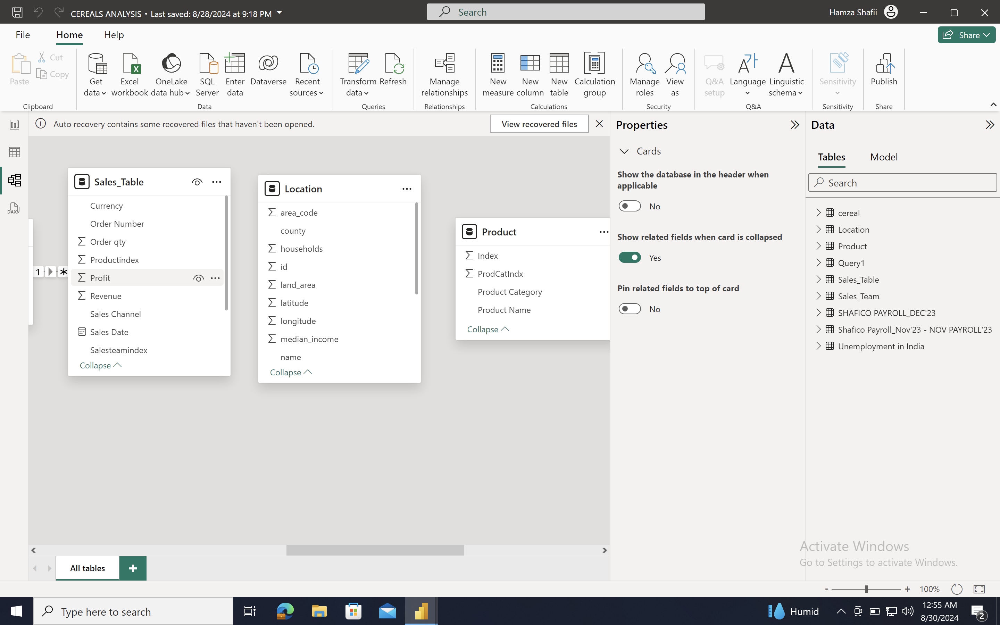
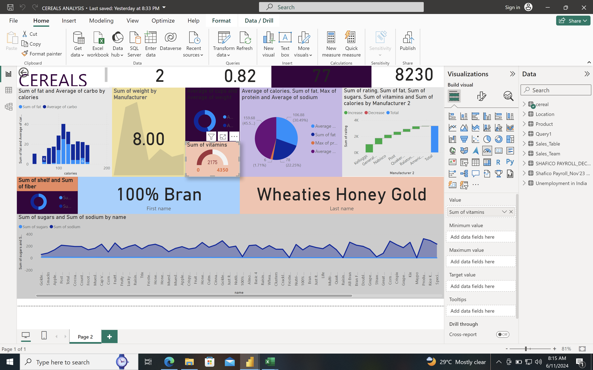

# Cognorise

## INTRODUCTION
introduction for the Cereals Analysis project 

## Cereals Analysis*

A data analysis project using Power BI to uncover insights and trends in the cereal market.

*Project Overview*

This project aims to analyze sales data from an imaginary cereal store, Cereals Analysis, to answer key business questions and inform data-driven decisions. The dataset includes information on cereal sales, customer demographics, and market trends.

*Key Objectives*

1. Analyze sales trends and patterns in the cereal market.
2. Identify top-performing cereal products and categories.
3. Examine regional sales performance and market penetration.
4. Investigate correlations between sales and external factors (e.g., seasonality, marketing campaigns).
5. Provide actionable insights to inform product development, pricing, and inventory management decisions.

*Dataset*

The dataset includes:

- Sales data (quantity, revenue, date)
- Customer demographics (age, gender, location)
- Cereal product information (type, category, price)
- Market trends (seasonality, marketing campaigns)

## Power BI Report

The project includes several Power BI reports, including:

- Sales Dashboard: Visualizing sales trends and patterns.
- Product Analysis: Identifying top-performing products and categories.
- Regional Analysis: Examining regional sales performance and market penetration.
- Correlation Analysis: Investigating correlations between sales and external factors.

# SKILLS AND CONCEPT DEMONSTRATED
# THE FOLLOWING POWER BI FEATURES WERE INCORPORATED:

* DATA CLEANING, DATA ABSTRACTION,DAX,MODELING AND SLICERS.

# DATA CLEANING
1.Handling missing values
2.Outlier detection and removal
3.Removing duplicate or inconsistent entries
4.Formatting and standardizing data(date, location, variety)

# DATA ABSTRACTION
* DATA AGGRETION:Grouping data by factors like region,crop variety,or time
* FEATURE EXTRACTION: Identifying key characteristics(e.g, grain size,shape)
* DATA TRANSFORMATION: Normalizing/scaling data(e.g.standardization).

# BENEFITS
It Improved data visualization
It Enhanced pattern recognition
It Reduced data Complexity
It increased efficiency

# DAX
Sales and Revenue Analysis*

1. Total Sales: `=SUM(Sales[Amount])`
2. Total Revenue: `=SUMX(Sales, Sales[Quantity] * Sales[Price])`
3. Sales by Region: `=SUMX(FILTER(Sales, RELATED(Regions[RegionName])), Sales[Amount])`
4. Top 5 Best-Selling Cereals: `=TOPN(5, Cereals, SUMX(RELATEDTABLE(Sales), Sales[Amount]), DESC)`

## Nutritional Analysis

1. Average Protein Content: `=AVERAGE(Cereals[Protein])`
2. Total Sugar Content: `=SUMX(Cereals, Cereals[Sugar])`
3. Fiber Content by Cereal Type: `=SUMX(FILTER(Cereals, RELATED(CerealTypes[CerealTypeName])), Cereals[Fiber])`
4. Nutrient Density: `=DIVIDE(SUMX(Cereals, Cereals[NutrientValue]), SUMX(Cereals, Cereals[Calories]))`

*Market Share and Competition*

1. Market Share: `=DIVIDE(SUMX(Sales, Sales[Amount]), SUMX(TotalMarket, TotalMarket[Amount]))`
2. Competitor Sales: `=SUMX(FILTER(Sales, RELATED(Competitors[CompetitorName])), Sales[Amount])`
3. Market Growth Rate: `=YOY(SUMX(Sales, Sales

# MODELING
 This involves  creating a data model to analyze cereals sales table,Location and Product

# VISUALIZATION

*Data Considerations*

1. Collected historical sales data (min. 2-3 years).
2. Included regional and seasonal variations.
3. Gather competitor sales data 
4. Consider demographic and socioeconomic factors.
5. Integrated nutrition and ingredient information.

*Analytical Focus Areas*

1. Sales trend analysis.
2. Market share analysis.
3. Regional and seasonal analysis.
4. Product portfolio analysis (cereal types, flavors).
5. Nutrition and health analysis (e.g., sugar content, fiber).
6. Competitor analysis.
7. Customer segmentation analysis.

*Key Performance Indicators (KPIs)*

Gross margin. Customer retention rate.
1. Sales growth rate.
2. Market share.
3. Revenue.
4. Product turnover rate.
5. Gross margin.
6. Customer retention rate.
   
*Visualization Best Practices*

1. Use interactive dashboards.
2. Employ geographical visualizations (maps).
3. Utilize bar charts and line charts.
4. Incorporate scatter plots and correlation analysis.
5. Used heat maps for product portfolio analysis.

*Tools and Technology*

1. Power BI.

*Methodologies*

1. Descriptive analytics.
2. Diagnostic analytics.
3. Predictive analytics (forecasting).
4. Prescriptive analytics (optimization).

*Common Challenges*

1. Data quality and consistency.
2. Data integration and merging.
3. Dealing with missing values.
4. Selecting relevant variables.
5. Interpreting results.

*Benefits*

1. Improved sales forecasting.
2. Enhanced market understanding.
3. Optimized product portfolio.
4. Better customer targeting.
5. Increased revenue and profitability.

*Future Directions*

1. Integrating AI and machine learning.
2. Using real-time data.
3. Exploring new data sources (e.g., social media).
4. Developing predictive models.
5. Creating personalized recommendations.

# INTERACTION.

*Contributions*590
